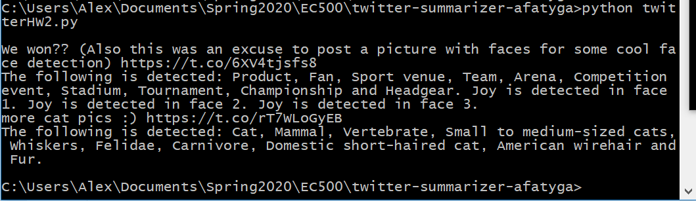
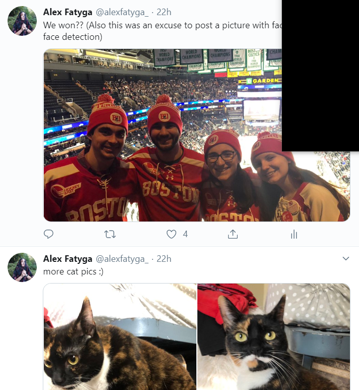
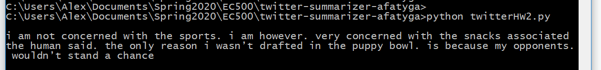
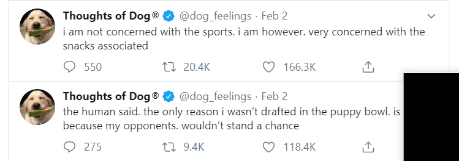

# twitter-summarizer-afatyga

# Assignment
Let’s build a module with an API that will return to the user of the API in text the twitter feed summary (Twitter Feeds and Text description of the images) => prints out the twitter feed summary in the terminal, returns a 1 on success  
I am expecting to use CB and CI in the exercise => completed  
I am also expecting you to developing examples using your API => See below  

# How to Use:
- Clone repo
- Get twitter keys (place in keys.py)
- Get Google Vision keys => gcloud iam service-accounts keys create key.json --iam-account vision-quickstart@wise-vim-266504.iam.gserviceaccount.com
- Run the following command: set GOOGLE_APPLICATION_CREDENTIALS=[PATH]\key.json]
- Run the following command: pip3 install -r requirements.txt
- Can now add tests to test_tweets.py as wanted
- Can now use function getMsgs from twitterHW2.py with a string input of your twitter username

# Flow of Code:
- I use the Tweepy API to receive a specified user's tweets and images
- Those images are saved to a JPG
- Each image goes through the Google Vision API for analysis
- A 1 is returned to indicate a success, a 0 for failure (incorrect input, not a real twitter handle, etc)
- At most 20 tweets of the past day along with the google vision analysis will be printed on the terminal for the user to see
- The tweets and image descriptions (labels and face detection) are formatted into a json file - tweets.json

# The Actual Process
I found Tweepy very easy to use and manage after authenticating. I simply sent the twitter handle in and received an output status object and was then able to filter the tweets to only get the most recent of the past 20 tweets.  
Google Vision was trickier because Google kept giving me warnings but I was able to find tutorials that helped me a lot.  
I filtered for the most recent tweets by checking the created at date in the Status object and comparing it to today's date.  
At first, I was having using issues with using Google Vision but I realized that I just needed to use the export command with the key.json file

# Examples of Use
My own twitter handle on 2/4/2020:  

Additionally, the tweets.json file goes accordingly with this example and can be examined to see how I format the output into a json file
   
  Another twitter handle at use on 2/2/2020    

